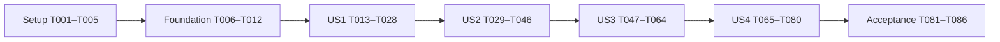

# Tasks: The Neon Velvet Mobile Game MVP

**Created**: 2026-09-27
**Working branch**: 001-tasks (feature directory is independent of branch name)
**Input**: [spec.md](spec.md), [plan.md](plan.md), [research.md](research.md),
[data-model.md](data-model.md), [runtime contract](contracts/runtime.md),
[delivery contract](contracts/delivery.md), and [quickstart.md](quickstart.md).

**Prerequisites**: Constitution v1.0.0 and current AGENTS.md apply. Use Bun 1.4.2 as package
manager, bun.lock, and bun run commands; keep Node 24.21.0 available for tool CLIs.
The package-manager change is reflected in the plan, research, and quickstart.

**Tests**: TDD is mandatory. Write and run meaningful failing tests before the matching
behavior, then implement and refactor. Minimal interface stubs can make a new test executable;
an import error alone is not an expected behavioral failure. Run all existing automated tests
before conventional commits on a feature branch. Define manual procedures before implementation.

**Execution**: All tasks start incomplete; this file claims no runtime verification. Execute
phases in order, and ascending IDs within each phase except the named parallel batches.
Complete each test/implementation pair before committing. Missing device/asset evidence stays
unchecked while independent work proceeds; final acceptance requires that evidence.

## Format and Path Conventions

- Tasks use checkbox, sequential Tnnn ID, optional [P], required [USn] inside story phases, and exact repository-relative paths.
- [P] marks disjoint-file work within a named batch after its prerequisite phase completes.
- Evidence lives in specs/001-neon-velvet-mvp/validation/; ignored test-results/ can hold large raw traces referenced by the records.
- Exact gameplay defaults come from data-model.md; changes require regression/playtest evidence.
- Source paths below are implementation targets; no application code is created by task generation.

## Phase 1: Setup (Shared Infrastructure)

**Purpose**: Establish the selected toolchain and validation harness.

- [X] T001 Verify a feature branch and initialize package.json, bun.lock, and .node-version with the plan's pinned dependencies, packageManager bun@1.4.2, Node 24.21.0, and matching Three types; use Bun and document required install lifecycle-script permissions in README.md (constitution III; AGENTS.md).
- [X] T002 Configure strict TypeScript and browser/worker build targets in tsconfig.json, vite.config.ts, and index.html; create the planned source directories and root static entry with ordinary-development worker registration disabled (NFR-001, NFR-005).
- [X] T003 Configure Vitest and Chromium/WebKit Playwright in vitest.config.ts, playwright.config.ts, and package.json; provide runnable development/build/test-build/diagnostics/preview scripts for early story checks and production-preview tests without substituting Bun's test runner; complete asset/precache audits in US4 (constitution III; runtime contract).
- [X] T004 Add generated-output ignores in .gitignore and Bun instructions in README.md; confirm bun install --frozen-lockfile reproduces the initial lock and tool CLIs start, without describing an empty suite as passing (constitution III; AGENTS.md).
- [X] T005 Define pre-implementation manual procedures and the requirements/evidence register in specs/001-neon-velvet-mvp/validation/procedures.md and specs/001-neon-velvet-mvp/validation/coverage.md, covering AC-001 through AC-034, SC-001 through SC-006, device versions, supplied music, and future AWS-origin checks.

**Checkpoint**: Tooling and evidence conventions are available. Full packaging scripts are
completed under US4 before offline acceptance.

## Phase 2: Foundational (Blocking Prerequisites)

**Purpose**: Establish deterministic state and clock boundaries shared by all stories.

- [X] T006 Define shared actor, attack, input, event, run, tuning, and level types in src/game/types.ts and src/content/types.ts with stable IDs and documented module boundaries (FR-002, FR-008, FR-016; data model).
- [X] T007 Write and observe failing fresh-state, ID allocation, deterministic step-order, and event-ownership tests in tests/unit/game/run.test.ts and tests/unit/game/step.test.ts; add controlled states in tests/fixtures/run.ts (FR-002, FR-003, FR-016).
- [X] T008 Implement pure run creation and the ordered tick pipeline in src/game/run.ts and src/game/step.ts, exposing stages for later systems and importing no browser/rendering APIs; pass T007 (FR-002, FR-003).
- [X] T009 Write and observe failing configuration tests in tests/unit/content/tuning.test.ts for finite values, valid actor/attack bounds, tick conversion, and invalid-data rejection (FR-008, FR-012 through FR-018).
- [X] T010 Implement provisional tuning and validation in src/content/tuning.ts and src/content/validate.ts using the data-model baselines; pass T009 without shared mutable test state (FR-008 through FR-018, FR-025, FR-029).
- [X] T011 Write and observe failing active-wall-time, pause exclusion, fixed-step, backlog-cap, and accumulator-reset tests in tests/unit/app/clock.test.ts and tests/unit/app/loop.test.ts (FR-005; NFR-004).
- [X] T012 Implement injected clocks and frame scheduling in src/app/clock.ts and src/app/loop.ts; discarded simulation backlog must still count toward active time, while paused/terminal states never step; pass T011 (FR-005; NFR-004).

**Checkpoint**: All shared tests pass. Story phases depend on T001–T012.

## Phase 3: User Story 1 — Learn and Use Touch Combat (Priority: P1)

**Goal**: A representative encounter proves movement, attacks, dodge, special, and learning.

**Independent Test**: Use Cow, an allied collision fixture, and grunt targets for AC-001–007
and AC-022–024 before the full level exists. Autonomous Crow arrives in US2. Device evidence
covers real touch ergonomics and readable feedback.

### Tests for User Story 1

- [X] T013 [P] [US1] Write failing pointer tests in tests/integration/input/pointers.test.ts for movement ownership, independent action fingers, HUD precedence, deadzone/anchor, normalization, release/cancel/lost-capture, and one tap per pointerdown (FR-008 through FR-011; AC-002, AC-022).
- [ ] T014 [P] [US1] Write failing combat tests in tests/unit/game/combat.test.ts for facing/depth misses, swept contacts, one-hit registration, combo/buffer expiry, dodge boundaries, meter gain/spending, spin knockback, unavailable actions, and protection (FR-012 through FR-017; AC-003 through AC-007, AC-023).
- [ ] T015 [P] [US1] Write failing coordination tests in tests/unit/game/coordination.test.ts for two shared attack slots, waiting/repositioning, slot release, grunt warnings, no allied damage/body blocking, and repeated-hit prevention (FR-017 through FR-019, FR-029; AC-024).
- [ ] T016 [P] [US1] Write failing HUD/tutorial tests in tests/integration/ui/combat-ui.test.ts for health/meter/cooldown feedback, successful-action prompt completion, and non-color cues using controlled state/events (FR-006, FR-007, FR-015, FR-037; AC-001, AC-023).

### Implementation for User Story 1

- [X] T017 [US1] Implement pointer capture, movement/action ownership, joystick following, and command clearing in src/input/pointers.ts and src/input/frame.ts; pass T013 (FR-009 through FR-011).
- [ ] T018 [US1] Implement bounded movement, retained facing, collision volumes, and swept contacts in src/game/movement.ts and src/game/collision.ts; pass relevant T014/T015 cases and keep allies nonblocking (FR-008, FR-011, FR-016, FR-019).
- [ ] T019 [US1] Implement attack phases, one buffered action, combo windows, dodge/cooldown, and spin in src/game/actions.ts; apply documented simultaneous-input priority and pass action tests (FR-012 through FR-015; AC-003, AC-005, AC-006, AC-023).
- [ ] T020 [US1] Implement hit-target sets, damage batching, meter, knockback, and protection in src/game/damage.ts; wire movement/actions/damage into src/game/step.ts and pass remaining T014 cases (FR-014 through FR-017; AC-004, AC-006, AC-007).
- [ ] T021 [US1] Implement grunt approach/windup/recovery and shared attack slots in src/game/ai/grunt.ts and src/game/ai/attack-slots.ts; connect through src/game/step.ts and pass T015 (FR-018, FR-029; AC-024).
- [ ] T022 [US1] Create the orthographic scene, Cow/grunt silhouettes, shadows, action poses, hit effects, and warnings in src/presentation/scene.ts, src/presentation/actors.ts, and src/presentation/effects.ts; presentation never applies damage (FR-017, FR-029, FR-032, FR-037).
- [ ] T023 [US1] Implement safe-area joystick/buttons, health/meter, Pause affordance, and unavailable-action feedback in src/ui/combat.ts and src/ui/styles.css; connect pointer regions and pass HUD tests (FR-007, FR-009, FR-010, FR-015; NFR-003).
- [ ] T024 [US1] Implement contextual movement/attack/dodge/special prompts in src/ui/tutorial.ts, completing each only after a valid action; retain a storage boundary until persistence arrives in US3 (FR-006; AC-001).
- [ ] T025 [US1] Compose the training encounter in src/main.ts, src/app/game-app.ts, and src/content/training.ts; connect simulation, presentation, inputs, clock, and manual Pause/Resume that clears commands (FR-006 through FR-019; runtime contract).
- [ ] T026 [US1] Add and run failing-then-passing browser regressions in tests/e2e/touch-combat.spec.ts and tests/fixtures/browser.ts for input clearing, control overlap, combo/meter feedback, and prompts; fix integration defects at their owning modules (AC-001 through AC-007, AC-022 through AC-024).
- [ ] T027 [US1] Execute first-encounter touch/readability checks on available reference phones and record versions and early frame observations in specs/001-neon-velvet-mvp/validation/us1-device.md; leave unavailable device evidence pending (AC-001, AC-002, AC-022 through AC-024; NFR-002, NFR-003).
- [ ] T028 [US1] Run all existing automated tests and applicable type/build checks; record results and remaining manual gates in specs/001-neon-velvet-mvp/validation/us1-results.md without claiming the entire MVP is complete (US1; constitution III).

**Checkpoint**: First playable increment. US2 can begin after the code and automated checks
pass; missing phone evidence remains an open final gate.

## Phase 4: User Story 2 — Complete and Replay the Level with Crow (Priority: P1)

**Goal**: Four areas, Crow, enemy roles, Liam, pickups, and full result/retry flow.

**Independent Test**: With US1 combat, complete the level and controlled tests for partner
loss, solo victory, simultaneous lethal damage, waves, pickups, and reset.

### Tests for User Story 2

- [ ] T029 [P] [US2] Write failing Crow tests in tests/unit/game/crow.test.ts for target priorities/ties, follow/camera bounds, obstruction recovery, relative damage, permanent knockout, and prohibited table/pickup/special actions (FR-020 through FR-025; AC-009, AC-014, AC-026, AC-028).
- [ ] T030 [P] [US2] Write failing enemy/boss tests in tests/unit/game/enemies.test.ts for projectile lifetime/sweeps, charge warnings/recovery, reachable retreat, attack slots, one Liam phase change, and avoidable shockwave (FR-018, FR-028 through FR-030; AC-011, AC-027).
- [ ] T031 [P] [US2] Write failing progression/loot/terminal tests in tests/unit/game/level.test.ts for exact-once waves/drops, GO/unlock, Cow-only capped/full-health healing, reset, solo victory, and defeat-first lethal ties before pickups/spawns (FR-002 through FR-004, FR-026 through FR-031; AC-008 through AC-013, AC-028).
- [ ] T032 [P] [US2] Write failing session/storage tests in tests/integration/app/session.test.ts and tests/unit/platform/best-result.test.ts for loading/retry, HUD/boss values, result transitions, clock freeze, faster-only records, storage fallback, and no countdown (FR-001, FR-004, FR-005, FR-007; NFR-008; AC-025, AC-029).

### Implementation for User Story 2

- [ ] T033 [US2] Implement Crow targeting, follow/recovery, basic attacks, and knockout in src/game/ai/crow.ts; pass T029 and emit visible partner-status events (FR-020 through FR-025).
- [ ] T034 [US2] Implement zoner retreat/throwing, enforcer charge/recovery, and projectile lifecycle in src/game/ai/zoner.ts, src/game/ai/enforcer.ts, and src/game/projectiles.ts with swept collision and shared slots (T030; FR-018, FR-028, FR-029).
- [ ] T035 [US2] Implement Liam's rope/close attacks, half-health transition, and timed-dodge shockwave in src/game/ai/liam.ts; pass T030 without jumps, grabs, or summons (FR-030; AC-011).
- [ ] T036 [US2] Define all four areas, initial waves, walkable transitions, and two VIP tables in src/content/neon-velvet.ts; validate content and preserve provisional encounter compositions (FR-026 through FR-031).
- [ ] T037 [US2] Implement entry, wave spawning, alive-enemy tracking, camera-lock state, and GO/unlock in src/game/encounters.ts; pass progression tests, ignoring tables/pickups/Crow for enemy-clear conditions (FR-026 through FR-028; AC-008).
- [ ] T038 [US2] Implement Cow-only table damage, one drink per table, capped/contact healing, and reset in src/game/pickups.ts; pass T031 including full-health consumption and inactive actors (FR-031; AC-012, AC-013, AC-028).
- [ ] T039 [US2] Integrate all AI, projectiles, encounters, pickups, and terminal ordering in src/game/step.ts and src/game/run.ts; pass simultaneous-death and solo-victory cases before emitting results (FR-002, FR-003, FR-022, FR-023, FR-027; AC-009 through AC-012).
- [ ] T040 [US2] Implement horizontal tracking, complete locked-arena framing, bounds, and transitions in src/presentation/camera.ts; wire scene and GO feedback in src/presentation/scene.ts and src/ui/combat.ts (FR-026, FR-028; AC-008, AC-027).
- [ ] T041 [US2] Extend src/presentation/actors.ts and src/presentation/effects.ts with Crow, ranged/heavy/Liam poses, projectiles, charge lanes, shockwave warnings, and knockout visuals (FR-017, FR-022, FR-029, FR-030, FR-032; AC-011, AC-027, AC-028).
- [ ] T042 [US2] Implement loading/progress/retry, title, results, boss HUD, Return to title, and full Retry in src/ui/screens.ts and src/app/game-app.ts; normal Start now loads The Neon Velvet (T032; FR-001 through FR-007).
- [ ] T043 [US2] Implement validated best-time storage in src/platform/best-result.ts with failure fallback and no writes from failed/equal/slower runs; wire result timing in src/app/game-app.ts (T032; FR-005; NFR-008; AC-029).
- [ ] T044 [US2] Write and observe failing repeated-retry resource tests in tests/integration/presentation/resources.test.ts and full-level browser cases in tests/e2e/level.spec.ts, proving fresh state, single results, and stable transient ownership (FR-002 through FR-005; AC-008 through AC-014, AC-025 through AC-029).
- [ ] T045 [US2] Implement transient cleanup/shared resources in src/presentation/resources.ts and reset/disposal in src/app/game-app.ts; fix full-level integration until T044 passes (FR-002, FR-004; AC-012).
- [ ] T046 [US2] Execute full-level checks including solo victory after Crow falls; record area timings and outcomes in specs/001-neon-velvet-mvp/validation/us2-results.md and leave unperformed manual checks pending (AC-008 through AC-014, AC-025 through AC-029).

**Checkpoint**: Complete level and result paths work. Mobile reliability, final audio/art,
offline packaging, and player acceptance still follow.

## Phase 5: User Story 3 — Play Reliably on a Mobile Device (Priority: P1)

**Goal**: Complete audio, settings, presentation, interruption recovery, and device performance.

**Independent Test**: Controlled states and one encounter verify lifecycle/settings/audio;
the complete level on both phones establishes final visual/performance evidence.

### Tests for User Story 3

- [ ] T047 [P] [US3] Write failing lifecycle tests in tests/unit/app/lifecycle.test.ts for combined blockers, explicit Resume, command/clock clearing, terminal precedence, context loss, and reload-to-title (NFR-003, NFR-004; AC-015, AC-032).
- [ ] T048 [P] [US3] Write failing audio tests in tests/integration/audio/audio.test.ts for gesture start/resume, rejected play/decode fallback, independent levels, pause/retry without duplicates, and bounded voices (FR-034 through FR-036; AC-016, AC-030, AC-034).
- [ ] T049 [P] [US3] Write failing settings/tutorial tests in tests/unit/platform/preferences.test.ts for schema validation, corruption/storage denial, defaults, successful prompt persistence, and independent controls (FR-006, FR-036; NFR-008; AC-001, AC-017, AC-030).
- [ ] T050 [P] [US3] Write failing layout/capability tests in tests/integration/ui/layout.test.ts for portrait/undersized overlays, safe areas, HUD priority, Resume blockers, muted/no-shake cues, and WebGL failure/restoration (FR-007, FR-037; NFR-001, NFR-003; AC-018, AC-030).
- [ ] T051 [P] [US3] Write failing diagnostics tests in tests/unit/app/diagnostics.test.ts for rolling frame windows, pause exclusion, inclusion of combat stalls, percentile/stall summaries, and build/device metadata (NFR-002; SC-006).

### Implementation for User Story 3

- [ ] T052 [US3] Implement blockers/pause latch in src/app/lifecycle.ts and connect visibility/focus/orientation/context events to src/app/game-app.ts, input clearing, and the clock; pass T047 (NFR-003, NFR-004; AC-015, AC-032).
- [ ] T053 [US3] Prepare source/provenance instructions in assets/source/music/README.md, runtime public/assets/audio/music.mp3, short effects under public/assets/audio/, and entries in public/assets/catalog.json; use a labeled temporary track until owner audio arrives, retaining final acceptance as pending (FR-034, FR-036).
- [ ] T054 [US3] Implement one music element and short Web Audio effects in src/audio/audio.ts with gesture activation, pause/reset, independent levels, fallback, and voice limits; pass T048 (FR-034 through FR-036).
- [ ] T055 [US3] Implement versioned settings/tutorial storage in src/platform/preferences.ts with safe defaults and in-memory fallback; connect successful tutorial events from src/ui/tutorial.ts and pass T049 (FR-006, FR-036; NFR-008).
- [ ] T056 [US3] Implement title/pause settings and accessible overlays in src/ui/settings.ts, src/ui/screens.ts, and src/ui/styles.css; apply stored levels/shake and keep settings opened from pause paused on return (T049/T050; FR-036, FR-037; NFR-003).
- [ ] T057 [US3] Complete four stylized venue spaces, clothes/silhouettes, ground shadows, poses, and restrained effects in src/presentation/environments.ts, src/presentation/actors.ts, and src/presentation/effects.ts; keep muted/no-shake telegraphs readable (FR-032, FR-033, FR-037; AC-031).
- [ ] T058 [US3] Implement capabilities, viewport resizing, full camera fit, and context restoration in src/platform/capabilities.ts, src/presentation/scene.ts, and src/presentation/camera.ts; require explicit resume and explain unrecoverable reload (T050; NFR-001, NFR-003, NFR-004).
- [ ] T059 [US3] Implement local frame recording/export in src/app/diagnostics.ts and src/ui/diagnostics.ts; pass T051, gate diagnostics by build mode, and exclude combat mutation or telemetry (NFR-002, NFR-009; SC-006).
- [ ] T060 [US3] Connect audio/settings/lifecycle/diagnostics in src/app/game-app.ts, including soundtrack restart from Retry gestures, terminal audio, and clean resource reuse; pass US3 integration tests (FR-035 through FR-037; NFR-004, NFR-008).
- [ ] T061 [US3] Add and run browser regressions in tests/e2e/mobile-reliability.spec.ts for pause/resume, portrait/resize, reload, rejected audio, muted cues, settings corruption/persistence, and context loss; fix behavior at owning modules (AC-015 through AC-018, AC-030 through AC-032, AC-034).
- [ ] T062 [US3] Execute touch, audio, presentation, lifecycle, and settings procedures on both phones and record per-scenario evidence in specs/001-neon-velvet-mvp/validation/us3-device.md (AC-015 through AC-018, AC-030 through AC-032, AC-034).
- [ ] T063 [US3] Measure warmed-up full runs on both phones, record rolling-window/stall results in specs/001-neon-velvet-mvp/validation/performance.md, and optimize affected presentation modules until the documented 30 fps minimum passes (NFR-002; SC-006).
- [ ] T064 [US3] Run all existing tests/type checks and reconcile results in specs/001-neon-velvet-mvp/validation/us3-results.md; track missing track/phone evidence and require final-release rechecks after US4 packaging (US3; constitution III/V).

**Checkpoint**: Mobile reliability is implemented and evidenced where assets/hardware are
available; final cached-release rechecks remain mandatory.

## Phase 6: User Story 4 — Install and Replay Offline (Priority: P2, Required for MVP)

**Goal**: AWS-compatible static release with installation, full cached media, truthful
readiness, and updates safe across multiple clients.

**Independent Test**: Production build, persistent profile, online preparation, closed-page
offline relaunch, full completion/retry with music, and two-version update validation.

### Tests for User Story 4

- [ ] T065 [P] [US4] Write failing packaging tests in tests/unit/build/assets.test.ts for hashed content/catalog mapping, build identity, complete inventory, external/nested resources, budgets/missing files, and no test controls in release (NFR-005 through NFR-007; FR-034).
- [ ] T066 [P] [US4] Write failing worker-protocol tests in tests/unit/platform/cache-protocol.test.ts for version/build matching, timeouts, complete audit, corrupt/missing entries, repair/storage failure, and waiting-versus-active identity (NFR-006, NFR-007; AC-020, AC-021).
- [ ] T067 [P] [US4] Write failing media tests in tests/integration/pwa/media.test.ts for full cached 200, valid 206 and invalid 416 responses, and range-route precedence over ordinary precache handling (FR-034; NFR-006; AC-019, AC-034).
- [ ] T068 [P] [US4] Define failing browser suites in tests/e2e/offline.spec.ts and tests/e2e/updates.spec.ts with persistent profiles and two releases served at one origin by tests/fixtures/release-server.ts; include running/paused clients and close-all activation (NFR-005 through NFR-007, NFR-009; AC-019 through AC-021, AC-033).

### Implementation for User Story 4

- [ ] T069 [US4] Implement versioned content/catalog packaging and inventory in scripts/package-assets.ts and scripts/asset-inventory.ts, sharing page/worker build ID without self-referential hashes; pass corresponding T065 cases (NFR-006; delivery contract).
- [ ] T070 [US4] Implement static-output, budget, and precache audits plus release/test/diagnostics modes in scripts/audit-build.ts, vite.config.ts, and package.json; finalize quickstart scripts with Bun and fail on omissions or leaked test controls (T065; NFR-005 through NFR-007, NFR-009).
- [ ] T071 [US4] Create installation icons at public/icons/icon-192.png, public/icons/icon-512.png, and public/icons/maskable-512.png; configure root start/scope, standalone, landscape preference, and HTML metadata in vite.config.ts and index.html (NFR-005; AC-033).
- [ ] T072 [US4] Implement injectManifest precaching, cached-shell fallback, and full/range-aware music delivery in src/sw.ts with app-specific caches; omit skipWaiting/clientsClaim and forced reloads (T067/T068; NFR-006, NFR-007; FR-034).
- [ ] T073 [US4] Implement versioned AUDIT_CACHE/REPAIR_CACHE messages, digest/existence checks, bounded repair, and revision-key writes in src/platform/cache-protocol.ts and src/sw.ts; reject mixed builds and pass T066 (NFR-006, NFR-007; AC-020).
- [ ] T074 [US4] Implement production registration, message timeouts, active-build audit/repair, and waiting status in src/platform/worker-client.ts; readiness is never persisted and old active clients prevent new-worker activation (T066/T068; NFR-006, NFR-007).
- [ ] T075 [US4] Add installation guidance, offline status/retry, and title/results-only close-all update notice in src/ui/offline.ts and src/app/game-app.ts; failed offline preparation alone cannot block loaded online play (FR-001; NFR-005 through NFR-007; AC-020, AC-033).
- [ ] T076 [US4] Run worker/media/offline/update suites including deletion/corruption, interrupted caching, denied storage, full relaunch, two clients, and music after retry; resolve failures in tests/e2e/offline.spec.ts, tests/e2e/updates.spec.ts, and owning modules (AC-019 through AC-021, AC-033, AC-034).
- [ ] T077 [US4] Validate static-root output with scripts/audit-build.ts and document future S3/CloudFront headers, content types, missing-asset errors, range handling, and safe publication in README.md; this task does not provision or deploy AWS resources (NFR-005 through NFR-007, NFR-009; AWS clarification).
- [ ] T078 [US4] Execute offline relaunch/completion/retry with the intended soundtrack and installed mode where supported on both phones; record cache repair and multi-window update evidence in specs/001-neon-velvet-mvp/validation/us4-device.md (AC-019 through AC-021, AC-033, AC-034).
- [ ] T079 [US4] Run frozen Bun install, all tests, type checking, release build, and release audit; record reproducibility, asset identity/size, and no-test-controls evidence in specs/001-neon-velvet-mvp/validation/us4-results.md (NFR-005 through NFR-009).
- [ ] T080 [US4] Repeat US3 audio/lifecycle/performance checks against the final cached release and reconcile specs/001-neon-velvet-mvp/validation/coverage.md; keep missing-phone/track entries pending (AC-015 through AC-021, AC-030 through AC-034; SC-005, SC-006).

**Checkpoint**: All required stories are implemented. Offline acceptance needs actual cached
runs; static compatibility does not imply AWS has been provisioned.

## Phase 7: Polish and Complete MVP Acceptance

**Purpose**: Establish all measurable outcomes on the accepted release.

- [ ] T081 Record the five-casual-player evaluation in specs/001-neon-velvet-mvp/validation/playtest.md with learning time, up to three attempts, first successful active duration, Crow survival, and separate responsiveness/readability ratings (SC-001 through SC-004).
- [ ] T082 Tune existing values in src/content/tuning.ts and src/content/neon-velvet.ts from playtest evidence; write regressions before behavioral fixes and record changes/re-evaluation in specs/001-neon-velvet-mvp/validation/playtest.md until all player targets pass, including solo viability (SC-001 through SC-004; FR-023, FR-025).
- [ ] T083 Re-run affected tests/device/offline/performance checks after final tuning/assets and close the 34-scenario register in specs/001-neon-velvet-mvp/validation/coverage.md; record final build/track identity without closing unperformed checks (SC-005, SC-006).
- [ ] T084 Update README.md and specs/001-neon-velvet-mvp/quickstart.md to match implemented Bun commands, controls, asset replacement, limitations, static release handling, and future AWS checks; reconcile spec/plan changes if required (constitution I; NFR-005).
- [ ] T085 Run the complete frozen-install/test/typecheck/release-build/audit sequence and record exact commands/results in specs/001-neon-velvet-mvp/validation/final.md; confirm feature-branch and conventional-commit rules before any commit (constitution III; AGENTS.md).
- [ ] T086 Record the final acceptance decision and remaining dependencies in specs/001-neon-velvet-mvp/validation/final.md; accept only when SC-001 through SC-006 and all four stories have actual passing evidence.

## Dependencies and Execution Order

### Phase dependencies

This is the default safe order. Story arrows require completed code and applicable automated
checks, not falsely completed manual records. Blocked phone/owner-track checks remain unchecked;
continue independent work when its code prerequisites are met. Final acceptance depends on
every such manual task.

### Test-to-implementation dependencies

| Tests / procedure | Implementation and validation dependents |
| --- | --- |
| T005 manual protocols | T027, T046, T062–T064, T078–T083 |
| T007 | T008 |
| T009 | T010 |
| T011 | T012 |
| T013 | T017, T023, T025–T026 |
| T014 | T018–T020, T025–T026 |
| T015 | T018, T021, T025–T026 |
| T016 | T023–T026 |
| T029 | T033, T039, T041 |
| T030 | T034–T035, T039, T041 |
| T031 | T036–T039 |
| T032 | T042–T043 |
| T044 | T045–T046 |
| T047 | T052, T058, T060–T061 |
| T048 | T053–T054, T060–T061 |
| T049 | T055–T056, T060–T061 |
| T050 | T056–T058, T060–T061 |
| T051 | T059 |
| T065 | T069–T071, T077, T079 |
| T066 | T073–T075 |
| T067 | T072, T076 |
| T068 | T072, T074–T076 |

Establish the expected behavioral failure before implementation. Browser regression tasks
T026, T044, T061, and T068 may need minimal fixture entry points to reach the scenario;
fixtures must not implement the behavior under test. Release audits exclude fixture controls.

Core integration files src/game/step.ts, src/app/game-app.ts, vite.config.ts, and package.json
have sequential owners. Do not edit them concurrently.

### Parallel opportunities and examples

Only these disjoint test-authoring batches carry [P]. Complete shared setup first and join
each batch before implementation. Shared fixture-helper changes remain serialized.

| Story | Parallel batch | Independent work |
| --- | --- | --- |
| US1 | T013, T014, T015, T016 | Pointer adapter; combat; coordination; HUD/tutorial |
| US2 | T029, T030, T031, T032 | Crow; enemies/boss; level/loot; session/results |
| US3 | T047, T048, T049, T050, T051 | Lifecycle; audio; settings; layout; diagnostics |
| US4 | T065, T066, T067, T068 | Packaging; worker protocol; media; offline/updates |

Example for each row: after the previous phase's code gate passes, assign the named test files
to separate workers, collect expected failures, then join before the first implementation.
[P] describes compatibility; it does not request automatic agent spawning.

## Requirement and Scenario Coverage

Ranges include every intervening identifier. Each group has implementation and verification.

| Requirements | Main task owners | Scenarios |
| --- | --- | --- |
| FR-001–005, FR-007 | T007–T012, T032, T039, T042–T046 | AC-010, AC-012, AC-025, AC-029 |
| FR-006 | T016, T024, T049, T055 | AC-001 |
| FR-008–011 | T013, T017–T018, T023–T026 | AC-002, AC-022 |
| FR-012–017 | T014, T018–T020, T026 | AC-003–007, AC-023 |
| FR-018–019 | T015, T018, T021, T030, T034–T035 | AC-024 |
| FR-020–025 | T029, T033, T039, T041, T046 | AC-009, AC-014, AC-026, AC-028 |
| FR-026–030 | T030–T031, T034–T037, T039–T041, T044–T046 | AC-008, AC-011, AC-027 |
| FR-031 | T031, T036, T038, T044–T046 | AC-012–013, AC-028 |
| FR-032–033 | T022, T041, T057, T062 | AC-031 |
| FR-034–037 | T048–T050, T053–T057, T060–T062, T067, T072, T078 | AC-016, AC-030, AC-034 |
| NFR-001–004 | T011–T012, T047, T050–T052, T058–T064, T080 | AC-015, AC-018, AC-032 |
| NFR-005–007, NFR-009 | T059, T065–T080 | AC-019–021, AC-033–034 |
| NFR-008 | T032, T043, T049, T055–T056, T061 | AC-001, AC-017, AC-029 |
| SC-001–004 | T081–T082 | Five-player evaluation |
| SC-005–006 | T063–T064, T078–T080, T083–T086 | All 34 scenarios and both performance gates |

## Implementation Strategy

1. Deliver US1 as the first playable increment and inspect touch combat on reference phones.
2. Complete US2 for full runs, Crow loss, Liam, healing, defeat, and retry.
3. Finish US3 mobile/audio/presentation behavior and obtain device evidence early.
4. Complete US4's cached release and repeat device checks with the supplied soundtrack.
5. Complete player evaluation, evidence-led tuning, and every acceptance gate.

**MVP scope**: All four stories and final acceptance are required by the PRD. US1 is the
recommended first demonstration, not a reduction of the one-level MVP commitment.

**Deferred**: AWS provisioning, account/region/domain selection, deployment automation,
public publishing, native/Capacitor packaging, and future gameplay features. Check static
output and hosting contracts now; repeat origin-specific checks when deployment is scheduled.

**Task counts**: 86 total — Setup 5, Foundation 7, US1 16, US2 18, US3 18, US4 16,
Final acceptance 6. Seventeen tasks form four explicit parallel batches.
